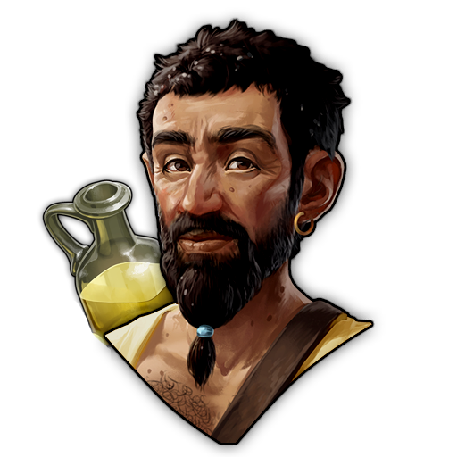
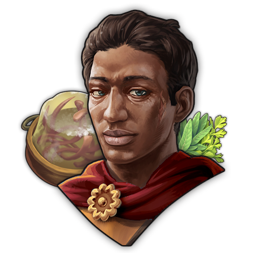

# Consumption Specialist Pack - Mod
This mod adds Specialists with focus on Consuption and their additional Attributes into Anno 117. This Mod is part as a submod of "Extended Specialists Mod".
***

General Balancing "Guideline":
| Rarity | Total Attribute | Consumption Inc
| :---: | :---: | :---: |
Common | +1 Attribute | +15%
Rare | +2 Attribute | +25%
Epic | +3 Attribute | +35%
Legendary | +4 Attribute | +50%
Legendary Boosted | >=5 Attribute | >=50% 

### Specialists Overview (AI Generated - might still contain Issues)
***
### Common Specialists
| Image Preview | GUID | Internal Name | Itemname | Description | Targets | Base Effects |
| :---: | :---: | :---: | :---: | :---: | :---: | :---: |
|  | 1600000031 | Specialist NR-Inc-PileusReedShoes-C | Young Tailor | Repairs some clothes to gain experience. (Consumption-Pack) | Residences | • +15% Consumption of: • Reed Shoes • Pileus Mentioned Goods grant: • Belief: +1 |
|  | 1600000562 | Specialist NR-Inc-GoodsCeres-C | Sacrifice Collector of Ceres | Collects goods for a sacrifice in the name of Ceres. (Consumption-Pack) | Residences | • +15% Consumption of: • Beer • Bread • Olive Oil Mentioned Goods grant: • Belief: +1 |
|  | 1600000564 | Specialist NR-Inc-GoodsCernunnos-C | Sericus Garum, Far Eastern Spicer | Adds a particularly salty flavor to everything. Creates a taste of the desert on the tongue. (Consumption-Pack) | Residences | • +15% Consumption of:  • Eels • Reed Shoes • Amphorae Mentioned Goods grant: • Belief: +1 |
|  | 1600000566 | Specialist NR-Inc-GoodsEpona-C | Sacrifice Collector of Epona | Collects goods for a sacrifice in the name of Epona. (Consumption-Pack) | Residences | • +15% Consumption of:  •Cheese • Sausages • Trousers Mentioned Goods grant: • Belief: +1 |
|  | 1600000568 | Specialist NR-Inc-GoodsMars-C | Sacrifice Collector of Mars | Collects goods for a sacrifice in the name of Mars. (Consumption-Pack) | Residences | • +15% Consumption of: • Sandals • Clan Shields • Chariots Mentioned Goods grant: • Belief: +1 |
|  | 1600000572 | Specialist NR-Inc-GoodsMinerva-C | Sacrifice Collector of Minerva | Collects goods for a sacrifice in the name of Minerva. (Consumption-Pack) | Residences | • +15% Consumption of: • Tunics • Pileus • Cloaks Mentioned Goods grant: • Belief: +1 |
|  | 1600000574 | Specialist NR-Inc-GoodsNeptune-C | Sacrifice Collector of Neptuns | Collects goods for a sacrifice in the name of Neptun. (Consumption-Pack) | Residences | • +15% Consumption of: • Sardines • Cockles • Garum Mentioned Goods grant: • Belief: +1 |

***
### Rare Specialists
| Image Preview | GUID | Internal Name | Itemname | Description | Targets | Base Effects |
| :---: | :---: | :---: | :---: | :---: | :---: | :---: |
|  | 1600000214 | Specialist NR-Inc-GoodsMercury-R | Oily Salesman | Frequently slips and ends up in the puddles left by his trail of olive oil. (Consumption-Pack) | Residences | • +25% Consumption of Olive Oil • Mentioned Goods grant: • Health: +1  • Population: +1 |
|  | 1600000182 | Specialist AE-NR-Theater-Inc-Toga-R | Aspiring Toga Designer | Uses the theater stage to present his first toga collection. Hint: The effect applies to all residential buildings within Street Range of the theater. (Consumption-Pack) | Residences in Range of: Theater | • +25% Consumption of Togas • Mentioned Goods grant: • Prestige: +2 • Money: +1 |
|  | 1600000570 | Specialist NR-Inc-GoodsMercury-R | Sacrifice Collector of Merkur-Lugus | Collects goods for a sacrifice in the name of Merkur-Lugus. (Consumption-Pack) | Residences | • +25% Consumption of: • Necklaces  • Brooches • Mentioned Goods grant: • Belief: +2 • Money: +2 |
|  | 1600000170 | Specialist AE-NR-CTHall-Inc-Roast-R | Rushed Roaster | Cooks the roast very quickly... unfortunately not long enough. Hint: The effect applies to all residential buildings within Street Range of the Alder Council. (Consumption-Pack) | Residences in Range of: Alder Council | • +25% Consumption of Roast Beef Mentioned Goods grant: • Population: +1 • Money: +2 • Health: -1 |
|  | 1600000327 | Specialist NR-Inc-BirdTongue-R | Aspic Seasoner | Tries different spices to make the aspic at least tolerable. (Consumption-Pack) | Residences | • +25% Consumption of Bird Tongues in Aspic Mentioned Goods grant: • Happiness: +2  |
|  | 1600000160 | Specialist NR-Inc-FineGlass-R | Elephas Vitreus | "Ahhh... not again! Damn it! I broke the glass again!" (Consumption-Pack) | Residences | • +25% Consumption of Fine Glass Mentioned Goods grant: • Money: +2 • Prestige: +2 • Health: -2  |
|  | 1600000158 | Specialist NR-Inc-Wigs-R | Wig Fixing Specialist | "If it doesn't fit, we'll make it fit! This might hurt a little..." (Consumption-Pack) | Residences | • +25% Consumption of Wigs Mentioned Goods grant: • FireSafety: +3 • Health: -1  |
|  | 1600000196 | Specialist NR-Inc-Soap-R | Soap Hoarder | "Soap is far too precious to use! This lovely scent must never fade!" (Consumption-Pack) | Residences | • +25% Consumption of Soap Mentioned Goods grant: • Prestige: +4 • Health: -1  |
***
### Epic Specialists
| Image Preview | GUID | Internal Name | Itemname | Description | Targets | Base Effects |
| :---: | :---: | :---: | :---: | :---: | :---: | :---: |
|  | 1600000114 | Specialist NR-Inc-GoodsMercury-R | Ulpius, Bacchus Blessed | "And the next round goes on me!" | Residences | • +35% Consumption of Beer Mentioned Goods grant: • Money: +2 • Happiness: +2 • Health: -1 |
|  | 1600000104 | Specialist AllGoods-Red-E | Iana Rodericia, Young Environmentalist | Rejects decadence and instead demonstrates an ecological lifestyle in harmony with nature. | Residences | • Consumption Modifier: -15% |
|  | 1600000044 | Specialist AE-NR-Bath-Red-Soap-E | Valerius Saponius, Master of the Soap | By using soap in big pools of water we can clean so many people at once. Hint: The Effects are applying to every building in Street Range. | Residences in Range of: Baths | • -15% Consumption of Soap Mentioned Goods grant: • Health: +1 |
|  | 1600000116 | Specialist NR-Inc-GoodsMercury-R | Sericus Garum, Far Eastern Spicer | Adds a particularly salty flavor to everything. Creates a taste of the desert on the tongue. (Consumption-Pack) | Residences | • +35% Consumption of Garum Mentioned Goods grant: • Money: +2 • Happiness: +2 • Health: -1 |
|  | 1600000313 | Specialist AE-NR-ForumMar-Inc-Cheese-E | Cassiocaseos, Culinarius Casei | Came up with the idea of melting cheese and combining it with sweet fruit. Some love this experimental cuisine, others hate it and give free rein to their anger. (Consumption-Pack) | Residences in Range of: Markets, Forum, Alder Council | • +35% Consumption of Cheese Mentioned Goods grant: • Money: +2 • Prestige: +1 • Happiness: -2 • Knowledge: +2 |
|  | 1600000262 | Specialist AE-NR-CSport-Inc-Trouser-E | Vercatullos, Sweaty Trainer | He will really make people sweaty. Everyone should have extra tunics and robes ready. Hint: The effect applies to all residential buildings within Street Range of the Sportsground. (Consumption-Pack) | Residences in Range of: Training Grounds | • +35% Consumption of: • Trousers Mentioned Goods grant: • Population: +1 • Money: +2 |
|  | 1600000695 | Specialist NR-Inc-Wine-E | Aemilia, the always packed Wine Merchant | “My wine is more important to me than my children!” | Residences | • +35% Consumption of: • Wine Mentioned Goods grant: • Money: +1 • FireSafety: +2 |
***
### Legendary Specialists
| Image Preview | GUID | Internal Name | Itemname | Description | Targets | Base Effects | Boosted Effect | Boosted Condition
| :---: | :---: | :---: | :---: | :---: | :---: | :---: | :---: | :---: |
|  | 1600000037 | Specialist NR-Inc-Chariots-L | Vipera Severus, Chariot Researcher | Chariots as everyday vehicles? Vipera makes it possible! | Residences | • +50% Consumption of: • Chariots Mentioned Goods grant: • Prestige: +2 • Knowledge: +3 | • +50% Consumption of: • Chariots Mentioned Goods grant: • Happiness: +1 • Prestige: +2 • Knowledge: +4 | 7500 Income & 5000 Knowledge on Island
|  | 1600000141 | Specialist NR-Inc-CShieldsSausage-L | Romano-Germanic Mercenary | This mercenary is ready to guard a neighborhood. And all he wants in payment is gear and sausages. | Residences | • +50% Consumption of: • Sausages • Clan Shields Mentioned Goods grant: • Population: +1 • Happiness: +2  • Health: +1 | • +50% Consumption of: • Sausages • Clan Shields Mentioned Goods grant: • Population: +1 • Happiness: +2  • Health: +1 • FireSafety: +1 | 2x Gambling House on Island
|  | 1600000385 | Specialist NR-Inc-Necklaces-L | Smeagolus Gollumus, Jewelry Addicted Patrician | "My Precious!" | Residences | • +50% Consumption of: • Necklaces Mentioned Goods grant: • Money: +4 • Belief: +1 | • +50% Consumption of: • Necklaces Mentioned Goods grant: • Money: +4 • Belief: +1  • Prestige: +2| 8x Jeweller on Island
|  | 1600000035 | Specialist NR-Inc-SandalsShoes-L | Iterius Lassus, Pilgrimage Organizer | His pilgrimages are always so long that your sandals practically fall off your feet. | Residences | • +50% Consumption of: • Sandals  • Reed Shoes Mentioned Goods grant: • Money: +1 • Belief: +2 • Health: +1 | • +50% Consumption of: • Sandals  • Reed Shoes Mentioned Goods grant: • Money: +1 • Belief: +3 • Health: +1| 1500 Belief on Island
|  | 1600000500 | Specialist NR-Inc-Tunics-L | Servius Rusticus, Pragmatic Craftsman | "People who dress in togas are weaklings and legalistic nitpickers! You can only fulfill your duties in a simple tunic!" | Residences | • +50% Consumption of: • Tunics  Mentioned Goods grant: • Population: +2 • Health: +1 • Knowledge: +1 | • +50% Consumption of: • Tunics  Mentioned Goods grant: • Population: +3 • Health: +1 • Knowledge: +1 | 3x Clothier on Island
***
